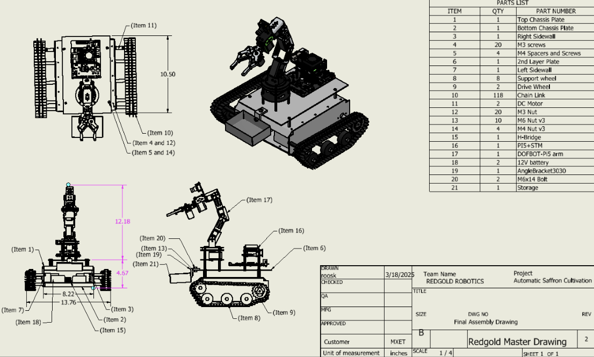

# Zixi Li – Engineering Portfolio

Welcome! I'm a Mechatronics Engineering student at Texas A&M specializing in robotics, AI, and embedded systems.

---

## Projects

### 🌸 Saffron Auto Harvester
- Led a multidisciplinary team to develop an autonomous robot capable of detecting, approaching, and extracting saffron stigmas from blossoms using real-time AI vision and a 6-degree-of-freedom (6-DOF) robotic arm.
- Programmed inverse kinematics (IK) algorithms in Python using the Jacobian matrix method to compute joint angles for a 6-DOF robotic arm, enabling sub-centimeter precision during stigma extraction.
- Integrated open-loop servo control with angle calibration and joint-limit safety checks to drive six PWM-controlled motors; optimized timing sequences to minimize jitter and lag during movement.
- Developed and trained a YOLOv4-tiny object detection model using Darknet framework on a dataset of 200,000+ labeled images, achieving 72.73% mAP in detecting saffron stigmas under variable lighting and occlusion conditions.
- Engineered a real-time distance estimation algorithm using the pinhole camera model and calibrated focal length, allowing for dynamic object tracking and chassis alignment based on bounding box dimensions.
- Implemented a state-machine-driven navigation and manipulation system, fusing Pi Camera input with Hailo AI accelerator inference and motor control logic to autonomously stop 30 cm from the blossom, align the arm, and perform extraction.
- Assembled custom mobile chassis using aluminum plates, DC motors, and tank tread system for high traction in agricultural terrain; designed gripper and arm mount to balance weight distribution.
- Designed and soldered a custom motor control board using L298N H-bridges and voltage regulators to interface high-power DC motors with Raspberry Pi GPIOs, enabling dual-direction control and PID tuning.
- Debugged system-wide integration errors between camera feed, YOLO inference, IK solver, and motor actuation using serial logging and step-through test scripts; achieved stable performance across 1-hour continuous operation.
- Managed project planning and procurement using WBS, Gantt charts, and a detailed Bill of Materials (BOM); coordinated 10+ material suppliers to keep costs within budget despite international shipping delays.
- Presented the system at the departmental design showcase with live demo of robotic stigma harvesting; received faculty recognition for innovation and cross-domain integration of AI and mechatronics.

---

### 🎯 Balloon Destroyer
- Autonomous color tracking and LIDAR-based obstacle avoidance  
- Real-time firing system based on target stillness  

📹 Demo Video: [Watch here](https://drive.google.com/file/d/13DOgFnZRKw2B_BtkJqVHfoBgalWu6pOa/view)

---

## 🛠️ Skills
Python • C++ • Embedded Systems • Blender • ROS2 • HVAC • MATLAB
